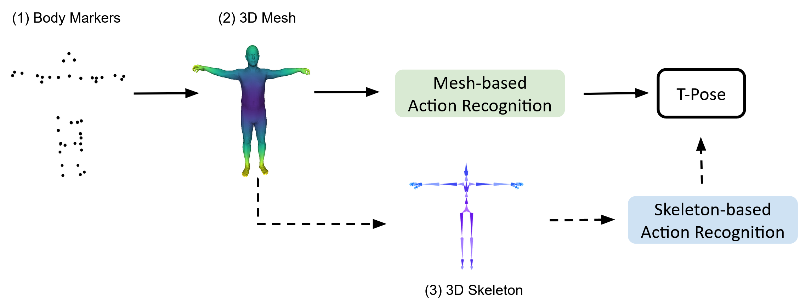

# STMT: A Spatial-Temporal Mesh Transformer for MoCap-Based Action Recognition
This repository contains the code for the following CVPR'23 paper:

**[STMT: A Spatial-Temporal Mesh Transformer for MoCap-Based Action Recognition](https://openaccess.thecvf.com/content/CVPR2023/papers/Zhu_STMT_A_Spatial-Temporal_Mesh_Transformer_for_MoCap-Based_Action_Recognition_CVPR_2023_paper.pdf)** 

# Introduction
We study the problem of human action recognition using motion capture (MoCap) sequences. Unlike existing techniques that take multiple manual steps to derive standardized skeleton representations as model input, we propose a novel Spatial-Temporal Mesh Transformer (STMT) to directly model the mesh sequences. The model uses a hierarchical transformer with intra-frame off-set attention and inter-frame self-attention. The attention mechanism allows the model to freely attend between any two vertex patches to learn non-local relationships in the spatial-temporal domain. Masked vertex modeling and future frame prediction are used as two self-supervised tasks to fully activate the bi-directional and auto-regressive attention in our hierarchical transformer. The proposed method achieves state-of-the-art performance compared to skeleton-based and point-cloud-based models on common MoCap benchmarks. 
<div align="center">
  <div style="">
      
  </div>
</div>

# Citation
If you find our work useful in your research, please consider citing:

```
@InProceedings{Zhu_2023_CVPR,
    author    = {Zhu, Xiaoyu and Huang, Po-Yao and Liang, Junwei and de Melo, Celso M. and Hauptmann, Alexander G.},
    title     = {STMT: A Spatial-Temporal Mesh Transformer for MoCap-Based Action Recognition},
    booktitle = {Proceedings of the IEEE/CVF Conference on Computer Vision and Pattern Recognition (CVPR)},
    month     = {June},
    year      = {2023},
    pages     = {1526-1536}
}
```

## Installation
**Requirements**
- Python 3.7
- [PyTorch 1.7.1](https://pytorch.org/get-started)
- [Human Body Prior](https://github.com/nghorbani/human_body_prior)
- [Pyrender](https://pyrender.readthedocs.io/en/latest/install/index.html#osmesa) for visualizations

Clone the [AMASS](https://github.com/nghorbani/amass/tree/master) repo and run the following from the root folder:
```bash
python install -r requirements.txt
python setup.py develop
```

# Dataset

+ Please download the KIT and BABEL dataset from [this link](https://babel.is.tue.mpg.de/data.html).

+ The dataset split is available at [Google Drive](https://drive.google.com/drive/folders/1UC_Ik7Diw_8jqB8EcE0iug1-VpC9B4ej?usp=sharing).

# Code
## Training and Inference
To perform training and inference, please run:
```
$ python3 main.py --root_path ./data/kit_pt_processed_dataset --save_root_dir ./ckpt/stmt_training --framenum 24
```

## Pre-Trained Model
Please use this link to download our pre-trained model: [Google Drive](https://drive.google.com/drive/folders/1_6ggzogjl170pjXzTikcOvriLQXRVIKh?usp=sharing)

## License
Our code and models are only for [ACADEMIC OR NON-PROFIT ORGANIZATION NONCOMMERCIAL RESEARCH USE ONLY](https://docs.google.com/document/d/1NdtHv8v9DulB_7BJpixWlcdXxouOeLRw/edit?usp=sharing&ouid=108800150781554114249&rtpof=true&sd=true).


## Acknowledgements
Our STMT is based on [AMASS](https://github.com/nghorbani/amass/tree/master) [Point-Spatio-Temporal-Convolution](https://github.com/hehefan/Point-Spatio-Temporal-Convolution), [P4Transformer](https://github.com/hehefan/P4Transformer) and [SequentialPointNet](https://github.com/XingLi1012/SequentialPointNet).
